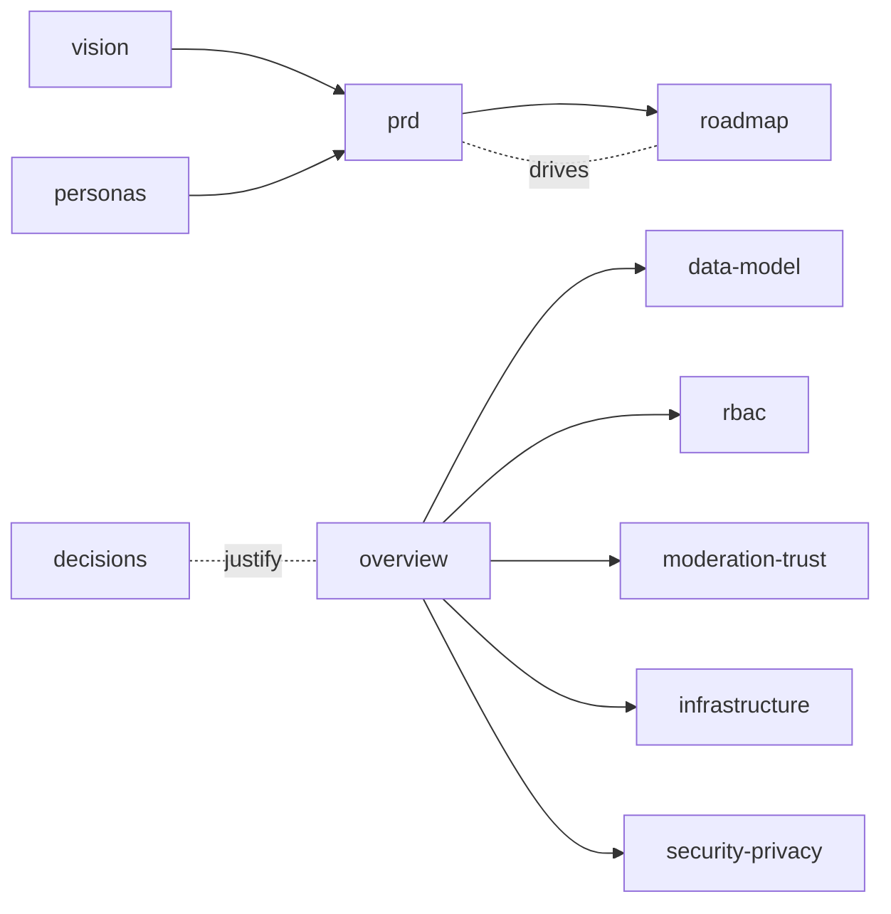

# La Feria CR — Project Documentation

Foundational documents for **La Feria CR** (Farmer Market CR), a community-maintained guide to
Costa Rica's farmer's markets (*ferias del agricultor*). These docs are the reference we will
implement against; they are living drafts and will evolve.

- **Language:** English (engineering docs).
- **Status legend:** 🟡 Draft · 🟢 Approved · ⚪ Stub/Planned
- The shipped **v0** application is documented in the repository [`../README.md`](../README.md).
- The official source data is `Lista_Ferias_del_Agricultor.xlsx` (June 2026) in this folder.

## Table of contents

### Product
| Doc | Description | Status |
| --- | --- | --- |
| [product/vision.md](product/vision.md) | Vision, audience, north star, goals & success metrics | 🟡 Draft |
| [product/personas.md](product/personas.md) | Target users incl. older / non-tech shoppers | 🟡 Draft |
| [product/prd.md](product/prd.md) | Requirements & user stories by release | 🟡 Draft |
| [product/roadmap.md](product/roadmap.md) | Phased roadmap (8 phases) | 🟡 Draft |
| [product/phase-1-tasks.md](product/phase-1-tasks.md) | Executable task list for Phase 1 | 🟡 Draft |
| [product/backlog.md](product/backlog.md) | Feature backlog & open questions | 🟢 Living |

### Architecture
| Doc | Description | Status |
| --- | --- | --- |
| [architecture/overview.md](architecture/overview.md) | System architecture on Azure | 🟡 Draft |
| [architecture/data-model.md](architecture/data-model.md) | Entities, ERD, promotion model | 🟡 Draft |
| [architecture/rbac.md](architecture/rbac.md) | Roles & permissions | 🟡 Draft |
| [architecture/moderation-trust.md](architecture/moderation-trust.md) | Confirmation, promotion & anti-abuse | 🟡 Draft |
| [architecture/infrastructure.md](architecture/infrastructure.md) | Azure services, IaC, CI/CD, cost | 🟡 Draft |
| [architecture/security-privacy.md](architecture/security-privacy.md) | Security, privacy & UGC terms | 🟡 Draft |

### Decisions (ADRs)
| Doc | Description | Status |
| --- | --- | --- |
| [decisions/README.md](decisions/README.md) | ADR index & template | 🟡 Draft |
| [decisions/0001-record-architecture-decisions.md](decisions/0001-record-architecture-decisions.md) | Adopt ADRs | 🟢 Accepted |
| [decisions/0002-frontend-stack-nextjs.md](decisions/0002-frontend-stack-nextjs.md) | Next.js + TS + Tailwind | 🟢 Accepted |
| [decisions/0003-compute-azure-container-apps.md](decisions/0003-compute-azure-container-apps.md) | Azure Container Apps | 🟢 Accepted |
| [decisions/0004-database-postgresql-flexible.md](decisions/0004-database-postgresql-flexible.md) | PostgreSQL Flexible + PostGIS | 🟢 Accepted |
| [decisions/0005-identity-entra-external-id.md](decisions/0005-identity-entra-external-id.md) | Entra External ID | 🟢 Accepted |
| [decisions/0006-maps-azure-maps.md](decisions/0006-maps-azure-maps.md) | Azure Maps | 🟢 Accepted |
| [decisions/0007-contribution-anonymous-propose-account-confirm.md](decisions/0007-contribution-anonymous-propose-account-confirm.md) | Anonymous propose, account to confirm | 🟢 Accepted |
| [decisions/0008-promotion-automated-confirmation-and-roles.md](decisions/0008-promotion-automated-confirmation-and-roles.md) | Auto-promotion + role governance | 🟢 Accepted |
| [decisions/0009-community-submitted-markets.md](decisions/0009-community-submitted-markets.md) | Community-submitted markets | 🟢 Accepted |

### Community & cross-cutting
| Doc | Description | Status |
| --- | --- | --- |
| [community/contributing.md](community/contributing.md) | How to contribute & confirm | 🟡 Draft |
| [community/content-guidelines.md](community/content-guidelines.md) | Content & conduct rules | 🟡 Draft |
| [accessibility.md](accessibility.md) | Accessibility targets & guidelines | 🟡 Draft |
| [glossary.md](glossary.md) | Domain & technical terms (ES↔EN) | 🟡 Draft |

## How these docs relate

---
_Last updated: 2026-06-30 · Maintainers: La Feria CR team_
