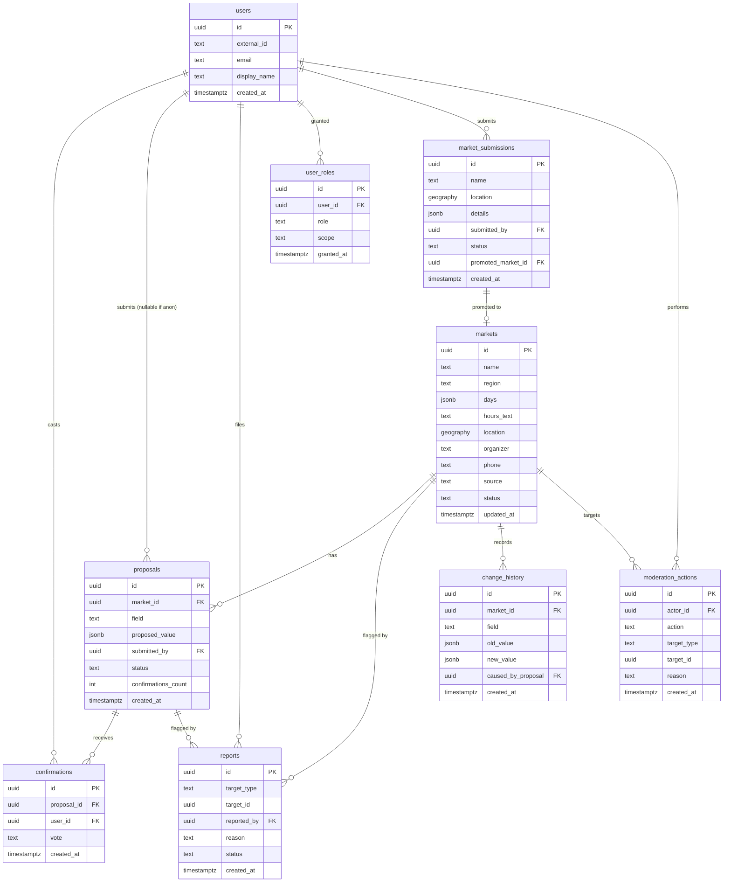

# Data Model — La Feria CR

**Status:** 🟡 Draft · _Last updated: 2026-06-30_

Logical data model for the community platform. Storage is **PostgreSQL Flexible Server + PostGIS**
([ADR-0004](../decisions/0004-database-postgresql-flexible.md)). This is a design reference, not a
migration script; final column types/indexes are settled during Phase 1.

## Design principles
- **Official list is seed truth.** Markets are seeded from the June 2026 spreadsheet; community input
  lives in `proposals`/`confirmations` and is **promoted** onto the market, never silently overwriting.
- **Auditable & reversible.** Every promoted change writes `change_history`; moderation writes
  `moderation_actions`.
- **Provenance everywhere.** Markets carry `source` (official vs community) and per-field freshness.

## Entity overview

## Entities

### markets
Canonical record per feria. Seeded from the official list, enriched by the community.
- `source`: `official` | `community`.
- `status`: `active` | `hidden` | `pending` (community-added awaiting confirmations).
- `days`: normalized canonical keys (`["fri","sat"]`) — see day-normalization below.
- `hours_text`: human string now (e.g. "5am–3pm"); may become structured later.
- `location`: PostGIS `geography(Point,4326)`, nullable until known.
- Per-field freshness/confidence derived from the latest promoted proposal.

### proposals
A suggested change to **one field** of a market (`field` ∈ `hours` | `location` | other).
- `proposed_value` is JSON (string for hours; `{lat,lng}` for location).
- `submitted_by` nullable → **anonymous proposals allowed**.
- `status`: `pending` | `verified` | `superseded` | `rejected`.
- `confirmations_count` cached for quick threshold checks.

### confirmations
One **account-gated** vote on a proposal. `vote`: `confirm` | `reject`. Unique on
`(proposal_id, user_id)` → one vote per user. Reaching threshold **N** confirms promotes the proposal.

### reports
Flags on a market or proposal (`target_type` + `target_id`). Feeds the moderation queue
([moderation-trust](moderation-trust.md)). `status`: `open` | `actioned` | `dismissed`.

### users
Created on first sign-in via Entra External ID. `external_id` maps to the IdP subject; minimal PII
(see [security-privacy](security-privacy.md)).

### user_roles
Grants a `role` (`member` | `trusted` | `community_safety` | `super_admin`) with optional `scope`
(e.g. region) for future regional moderators. See [rbac](rbac.md).

### market_submissions
Proposed **new** markets (Phase 5). Holds candidate details until promoted to a real `markets` row;
`promoted_market_id` links the result. Duplicate detection on name + proximity before acceptance.

### moderation_actions
Append-only audit of moderator/admin actions (remove, hide, ban, override, revert) — who/what/why/when.

### change_history
Append-only record of every promoted field change (old → new, causing proposal) enabling display of
history and **revert**.

## Day normalization (carried from v0)
Spanish day strings (e.g. "Viernes - sábado") are split on `[-,/]| y ` and mapped to canonical
ordered keys `mon…sun`. `WEEKEND_DAYS = {fri,sat,sun}` drives the "this weekend" default. Logic lives
in `scripts/generate_data.py` and is reused when seeding.

## Promotion & versioning
1. Proposal collects confirmations.
2. At **N** confirms it becomes `verified`; the market's field is updated and `change_history` is written.
3. Competing proposals for the same field are `superseded`.
4. Moderators/admins can reject or revert, writing `moderation_actions` (+ `change_history`).

Threshold **N** and weighting are policy — see [moderation-trust](moderation-trust.md). **N is an open
question** (start simple, e.g. 2–3 unweighted).

## Seeding
Phase 1 loads `src/data/ferias.json` (from the official xlsx) into `markets` with `source=official`.
Re-seeding is idempotent (upsert by stable key) and never clobbers community-verified fields.
