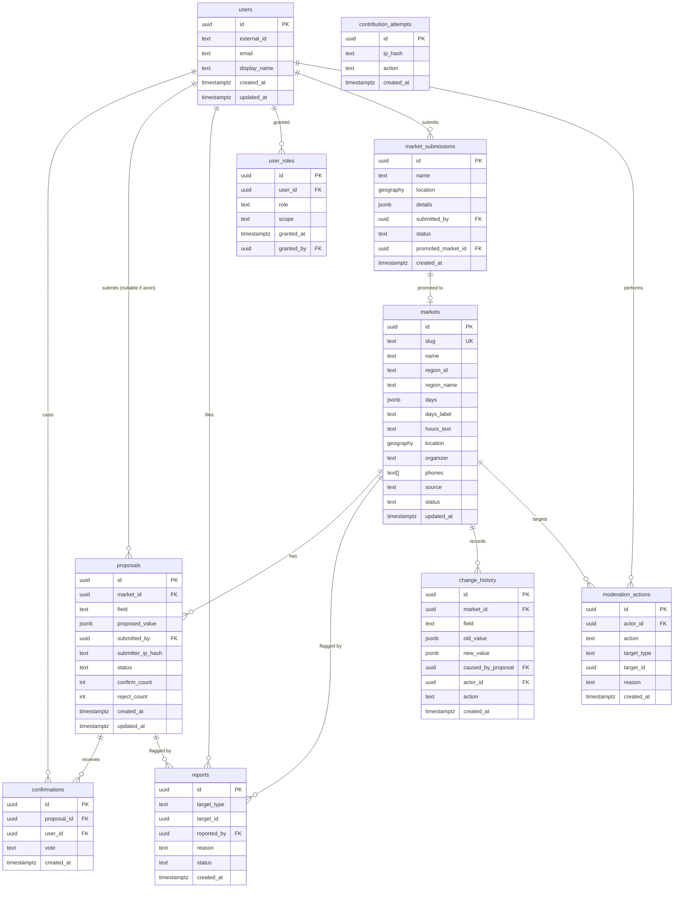

# Data Model — La Feria CR

**Status:** 🟡 Draft · _Last updated: 2026-07-01_

Logical data model for the community platform. Storage is **PostgreSQL Flexible Server + PostGIS**
([ADR-0004](../decisions/0004-database-postgresql-flexible.md)). This is a design reference, not a
migration script; final column types/indexes are settled during Phase 1.

## Design principles
- **Official list is seed truth.** Markets are seeded from the June 2026 spreadsheet; community input
  lives in `proposals`/`confirmations` and is **promoted** onto the market, never silently overwriting.
- **Auditable & reversible.** Every promoted change writes `change_history`; Phase 3 break-glass
  actions also audit there, while the dedicated `moderation_actions` table remains Phase 4.
- **Provenance everywhere.** Markets carry `source` (official vs community) and per-field freshness.

## Entity overview

## Entities

### markets
Canonical record per feria. Seeded from the official list, enriched by the community.
- `slug`: the stable v0 identifier, **unique** — used as the idempotent seed/upsert key.
- `source`: `official` | `community`.
- `status`: `active` | `hidden` | `pending` (community-added awaiting confirmations).
- `region_id` + `region_name`: kept as a pair (rather than a single `region`) to preserve exact v0
  parity — the UI groups by `region_id` and labels with `region_name`.
- `days`: normalized canonical keys (`["fri","sat"]`) — see day-normalization below.
- `days_label`: the original Spanish day string (e.g. "Viernes - sábado"); stored for provenance.
- `hours_text`: human string now (e.g. "5am–3pm"); may become structured later. Null until known.
- `phones`: `text[]` — markets can list multiple contact numbers (v0 parity).
- `location`: PostGIS `geography(Point,4326)`, nullable until known.
- Per-field freshness/confidence derived from the latest promoted proposal.

> **Phase 1 implementation note.** The deployed `markets` table (Prisma model, see
> [ADR-0010](../decisions/0010-orm-prisma.md)) splits `region` into `region_id`/`region_name` and uses
> `phones text[]`, plus `slug` and `days_label`, to mirror `src/data/ferias.json` exactly. The PostGIS
> `location` column and its GiST index are created via raw SQL in the initial migration because Prisma
> does not natively type `geography`.

### proposals
A suggested change to **one field** of a market (`field` ∈ `hours` | `location` in Phase 3).
- `proposed_value` is JSON (string for hours; `{lat,lng}` for location).
- `submitted_by` nullable → **anonymous proposals allowed**.
- `submitter_ip_hash` stores a salted hash for short-retention abuse controls; raw IPs are not stored.
- `status`: `pending` | `verified` | `superseded` | `rejected`.
- `confirm_count` and `reject_count` cache the vote totals for quick net-threshold checks. This refines
  the earlier single `confirmations_count` design and enables clean conflict display.
- Indexes: `(market_id, field, status)` and `(submitted_by)`.

### confirmations
One **account-gated** vote on a proposal. `vote`: `confirm` | `reject`. Unique on
`(proposal_id, user_id)` → one vote per user. Reaching threshold **N** net confirmations promotes
the proposal.

### reports
Flags on a market or proposal (`target_type` + `target_id`). Feeds the moderation queue
([moderation-trust](moderation-trust.md)). `status`: `open` | `actioned` | `dismissed`. Indexed by
`(target_type, target_id, status)`.

### users
Created on first sign-in via Entra External ID. **`external_id` is unique** and holds the token's
immutable `oid` claim (not `sub`); `email`/`display_name` are refreshed on each sign-in. Minimal PII
(see [security-privacy](security-privacy.md)). **Implemented in Phase 2** (`prisma/migrations/*_add_users`,
upserted from the Auth.js `jwt` callback in `src/auth.ts`); contribution tables arrive in Phase 3.

### user_roles
Grants a `role` (`member` | `trusted` | `community_safety` | `super_admin`) with optional `scope`
(e.g. region) for future regional moderators. Pulled forward into Phase 3 for break-glass admin
([ADR-0013](../decisions/0013-minimal-roles-phase-3-break-glass.md)); Phase 3 uses only
`super_admin`. Unique on `(user_id, role, scope)` plus a partial unique index where `scope IS NULL`
because Postgres treats NULLs as distinct. See [rbac](rbac.md).

### market_submissions
Proposed **new** markets (Phase 5). Holds candidate details until promoted to a real `markets` row;
`promoted_market_id` links the result. Duplicate detection on name + proximity before acceptance.

### moderation_actions
Append-only audit of moderator/admin actions (remove, hide, ban, override, revert) — who/what/why/when.
Deferred to Phase 4; Phase 3 break-glass actions are audited through `change_history`.

### change_history
Append-only record of every promoted field change (old → new, causing proposal) enabling display of
history and **revert**. Phase 3 adds nullable `actor_id` and `action` (`promote` | `override` |
`revert` | `hide`) so break-glass admin actions are reversible and audited.

### contribution_attempts
Durable Postgres-backed rate-limit log for anonymous writes (`proposal`, `report`). Stores salted
`ip_hash`, `action`, and `created_at`; old rows are pruned opportunistically. Operational data with
short retention, not part of the original design.

## Day normalization (carried from v0)
Spanish day strings (e.g. "Viernes - sábado") are split on `[-,/]| y ` and mapped to canonical
ordered keys `mon…sun`. `WEEKEND_DAYS = {fri,sat,sun}` drives the "this weekend" default. Logic lives
in `scripts/generate_data.py` and is reused when seeding.

## Promotion & versioning
1. Proposal collects account-gated confirmations and rejects.
2. At **N = 2** net confirmations (`confirm_count - reject_count`) it becomes `verified`; the market's
   field is updated and `change_history` is written.
3. Competing proposals for the same field are `superseded`.
4. Super Admin break-glass actions can override, revert, or hide, writing `change_history`.

Threshold **N** defaults to 2 and is configurable with `CONFIRMATION_THRESHOLD`; weighting remains
deferred — see [moderation-trust](moderation-trust.md).

## Seeding
Phase 1 loads `src/data/ferias.json` (from the official xlsx) into `markets` with `source=official`
via `prisma/seed.ts`. Re-seeding is idempotent (**upsert by `slug`**) and never clobbers
community-verified fields (`hours_text`/`location` are left untouched on update).
