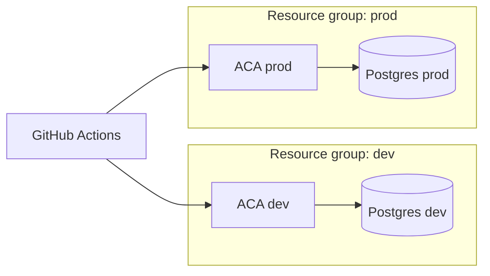
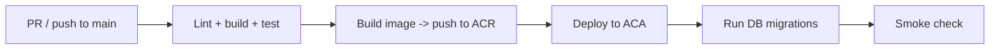

# Infrastructure — La Feria CR

**Status:** 🟡 Draft · _Last updated: 2026-06-30_

Azure footprint, environments, IaC, CI/CD, and **cost control**. Guiding constraint:
**minimize cost via serverless / scale-to-zero**. Component rationale lives in
[overview](overview.md) and the [ADRs](../decisions/README.md).

## Services & SKUs (starting point)
| Service | SKU / tier | Notes |
| --- | --- | --- |
| **Azure Container Apps** | Consumption | **Scale to zero**; min replicas 0 (prod may pin 1 to avoid cold start) |
| **Container Registry (ACR)** | Basic | Stores the app image |
| **PostgreSQL Flexible Server** | **Burstable B1ms** | +PostGIS; biggest fixed cost — see cost levers |
| **Entra External ID** | Pay-as-you-go (free MAU tier) | Google + email OTP |
| **Azure Maps** | Gen2 / S0 | Free monthly grant covers low traffic |
| **Key Vault** | Standard | Secrets only |
| **Application Insights / Log Analytics** | Pay-as-you-go + **sampling** | Cap daily ingestion |
| **Front Door + WAF** | Standard | **Incremental** — add when traffic/abuse warrant |
| **Blob Storage + CDN** | Hot / Standard | **Phase 8** (photos) only |

## Environments

- **dev** and **prod** are separate resource groups (ideally separate subscriptions) from the **same
  Bicep** with per-env parameters.
- Non-prod scales to zero and uses the smallest SKUs.

## Infrastructure as Code — Bicep
- All resources defined in **Bicep** modules (network-light: public endpoints + firewall rules first;
  private networking later if needed).
- Parameterized per environment (`main.bicep` + `*.bicepparam`).
- No secrets in templates — outputs wired to **Key Vault**; apps read via managed identity.
- Idempotent deploys; infra changes go through PRs like app code.

## CI/CD — GitHub Actions

- **CI:** `npm run lint` + `npm run build` (+ tests as added).
- **CD:** build/push image to ACR, deploy revision to Container Apps, run **DB migrations**, smoke-test.
- Federated credentials (OIDC) — **no long-lived cloud secrets** in GitHub.
- Environment protection rules gate prod.

## Observability
- App Insights for traces/metrics/logs across SSR + API; **sampling** to control cost.
- Health/readiness endpoints for ACA probes.
- Alerts: error-rate, p95 latency, DB CPU/connections, Maps/identity quota, **daily spend**.

## Scaling
- ACA scales on HTTP concurrency (and can scale to zero when idle).
- Postgres scales vertically (bump SKU) and via connection pooling (e.g. PgBouncer) as load grows.
- Front Door caching offloads read-heavy market browsing.

## Cost-control levers
- Scale-to-zero compute; smallest viable Postgres (**Burstable**); **stop dev DB** when unused.
- App Insights sampling + ingestion cap.
- Lean on **free grants** (Maps, Entra MAU).
- Defer Front Door, CDN, private networking until justified.
- Budget + cost alerts on each subscription/resource group.

## Backups & DR
- Postgres automated backups with point-in-time restore (retention per environment).
- IaC + container images make the platform **re-creatable**; data is the stateful asset to protect.
- Periodic restore test (Phase 6 hardening). Region-failover strategy documented when traffic warrants.

## Open questions
- Pin prod ACA to **min 1** replica (avoid cold starts) vs accept scale-to-zero latency.
- Private networking (VNet/Private Link for DB) now or later.
- Backup retention windows per environment.
