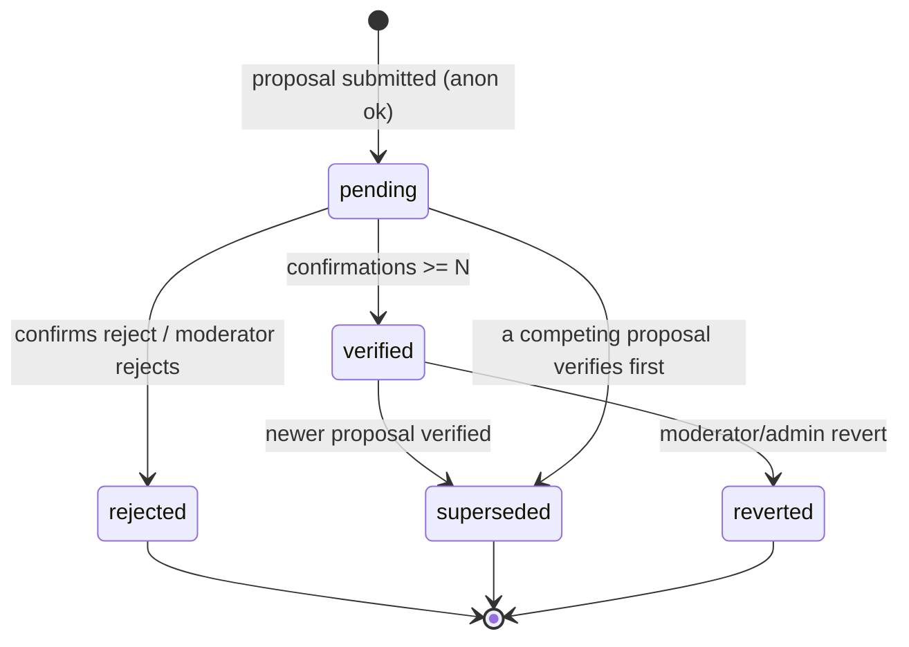
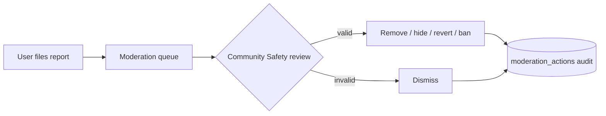

# Moderation & Trust — La Feria CR

**Status:** 🟡 Draft · _Last updated: 2026-06-30_

How community input becomes trustworthy "verified" data, and how abuse is contained. Combines an
**automated** confirmation loop ([ADR-0008](../decisions/0008-promotion-automated-confirmation-and-roles.md))
with a **human** safety layer ([rbac](rbac.md)). Entities in [data-model](data-model.md).

## Proposal lifecycle

- **pending** — collecting account-gated confirmations.
- **verified** — reached threshold **N**; value promoted onto the market (+ `change_history`).
- **superseded** — a newer verified proposal replaced this field's value.
- **rejected** — net-negative votes or moderator decision.
- **reverted** — undone by a moderator/admin (abuse or error).

## Confirmation threshold (N)
- Promotion is automatic at **N** net confirmations for the same proposed value.
- **N is an open question.** Start simple and conservative (e.g. **N = 2–3**, unweighted) and tune
  with real usage. N is Super-Admin configurable ([rbac](rbac.md)).
- **Reputation weighting** (Trusted/mod votes count more) is **deferred to Phase 6**; v1 is 1 user = 1 vote.

## Conflict resolution
- Multiple competing proposals for the same field can be open at once; users confirm the one they
  believe. The **first to reach N wins**; others become `superseded`.
- The detail page surfaces disagreement ("2 people say 5am, 1 says 6am") instead of hiding it.
- Persistent conflict (flip-flopping) escalates to the moderation queue.

## Reporting workflow

- Anyone (incl. anonymous) can report a market or proposal.
- Community Safety triages; actions are **reversible and audited**.
- Appeals go through [content-guidelines](../community/content-guidelines.md).

## Anti-abuse controls
| Vector | Control |
| --- | --- |
| Spam proposals | Per-IP/device **rate limits**; **CAPTCHA** on anonymous writes |
| Vote stuffing | **Account required** to confirm; one vote per user per proposal |
| Sock-puppets / sybil | Email-verified accounts; reputation + anomaly heuristics (Phase 6) |
| Bad new markets | Duplicate detection; pending until confirmed; moderation |
| Vandalism | Full history + **revert**; moderator removal; temp-bans |
| Coordinated attack | WAF/Front Door; alerting; Super-Admin break-glass overrides |

## Governance vs. automation
- **Automation** handles the happy path: propose → confirm → auto-verify. No human needed for normal edits.
- **Humans** (Community Safety, Super Admin) handle exceptions: abuse, conflicts, and policy. They do
  not gate everyday contributions.

## Trust signals shown to users
- Verified vs needs-confirmation badges; confirmation counts; last-updated; provenance
  (official vs community). These make data quality legible to non-technical users
  ([accessibility](../accessibility.md)).

## Open questions
- Final **N**, and when to enable reputation weighting.
- Moderator vetting and regional scoping.
- Auto-quarantine thresholds (e.g. N reports auto-hide pending review).
- Duplicate-detection strictness for new markets.
