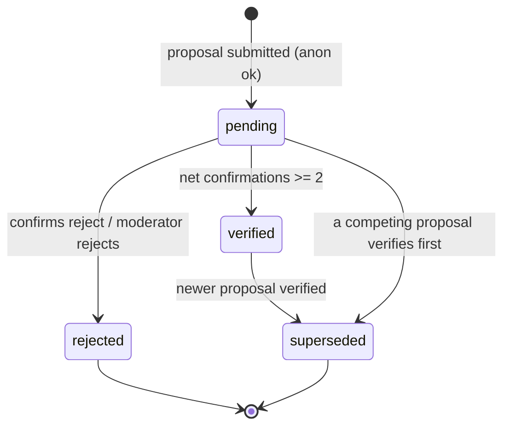
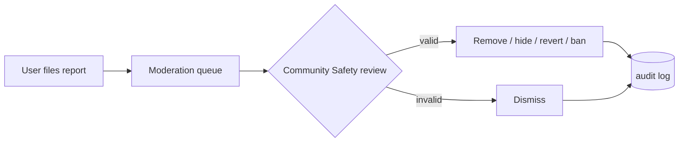

# Moderation & Trust — La Feria CR

**Status:** 🟢 Implemented (Phase 4) · _Last updated: 2026-07-03_

How community input becomes trustworthy "verified" data, and how abuse is contained. Combines an
**automated** confirmation loop ([ADR-0008](../decisions/0008-promotion-automated-confirmation-and-roles.md))
with a **human** safety layer ([rbac](rbac.md)). Entities in [data-model](data-model.md).

## Proposal lifecycle

- **pending** — collecting account-gated confirmations.
- **verified** — reached threshold **N = 2**; value promoted onto the market (+ `change_history`).
- **superseded** — a newer verified proposal replaced this field's value.
- **rejected** — net-negative votes or moderator decision.

## Confirmation threshold (N)
- Promotion is automatic at **N = 2** net confirmations for the same proposed value, where
  `net = confirm_count - reject_count`. This resolves OQ-001.
- N is resolved **DB → env → default 2**: the `app_config.confirmation_threshold` value (edited by a
  Super Admin at `/admin/settings`) takes precedence over the `CONFIRMATION_THRESHOLD` env var, which
  falls back to the built-in default ([ADR-0015](../decisions/0015-admin-configurable-settings-app-config.md)).
- **One-user-one-vote:** confirmations are unique per `(proposal_id, user_id)`.
- **Self-vote rule:** a signed-in proposer cannot confirm/reject their own proposal, and the
  proposer's vote never counts. Promotion requires N confirmations from other accounts; anonymous
  proposals start at 0.
- **Reputation weighting** (Trusted/mod votes count more) is **deferred to Phase 6**; v1 is 1 user = 1 vote.

## Confirmation backlog (moderator worklist)
- Moderators (Community Safety+) get a **"markets requiring attention"** view at
  `/admin/attention` that surfaces the **confirmation backlog**: markets with `pending`
  proposals that still need more net confirmations to reach **N**. It's a discovery aid for
  stale community suggestions — distinct from the reports queue (abuse) and read-only.
- Ordered **oldest/most-stale first**: the market whose longest-waiting pending suggestion has
  waited longest leads; suggestions within a market are likewise oldest-first. Each row shows
  the field, progress (`net X of N`, how many more are needed), and how long it's been waiting,
  and links to the market page where anyone signed in can confirm.
- Hidden/non-active markets are excluded (their suggestions can't be confirmed publicly). The
  view only reads state for community-driven confirmation (BL-020).
- **Approve from the queue (Super Admin, break-glass):** each backlog row shows the proposed
  value (hours text, or a location mini-map + Google Maps link) and — for Super Admins only — an
  **Approve** button. Approving **promotes the proposal immediately**, bypassing the N-confirmation
  threshold: it writes the value onto the market, marks the proposal `verified`, supersedes
  competing proposals for the same field, and records `change_history` (`action='override'`,
  linked via `caused_by_proposal`) plus a moderation audit entry (`override_field`,
  `target_type='proposal'`). This is the same authority as the market-page field override
  (`override_field` capability), surfaced in the worklist so an admin can clear a batch of
  official data (e.g. imported location pins) without visiting each market page. Community Safety
  moderators still only confirm/remove — they do not see the Approve action.

## Conflict resolution
- Multiple competing proposals for the same field can be open at once; users confirm the one they
  believe. The **first to reach N wins**; others become `superseded`.
- Promotion also supersedes competing pending/verified proposals for the same market field.
- The detail page surfaces disagreement ("2 people say 5am, 1 says 6am") instead of hiding it.
- Persistent conflict (flip-flopping) escalates to the moderation queue.

## Reporting workflow

- Anyone (incl. anonymous) can report a market or proposal.
- **Community Safety triages the queue (Phase 4):** open reports are grouped by target and ranked by
  open-report **count**, then recency. A moderator **resolves** (actioned) or **dismisses** all open
  reports on a target, can **remove** an abusive proposal, **hide/unhide** a market, and **temp-ban**
  the author; a Super Admin can additionally **override/revert** a field. Every action **dual-writes**
  `moderation_actions` (who/what/why) and, for field changes, `change_history` (for revert).
- **No auto-quarantine (OQ-009 deferred):** the queue only surfaces counts; nothing is auto-hidden.
  This is the safest default against coordinated false reports — all removals are manual.
- Appeals go through [content-guidelines](../community/content-guidelines.md) (channel & SLA — OQ-010).

## Anti-abuse controls
| Vector | Control |
| --- | --- |
| Spam proposals | Per-IP/device **rate limits**; **CAPTCHA** on anonymous writes |
| Vote stuffing | **Account required** to confirm; one vote per user per proposal |
| Sock-puppets / sybil | Email-verified accounts; reputation + anomaly heuristics (Phase 6) |
| Bad new markets | Duplicate detection; pending until confirmed; moderation |
| Vandalism | Full history + **revert**; moderator content removal; **temp-bans** (1d/7d/30d/permanent, block all writes) |
| Coordinated attack | WAF/Front Door; alerting; Super-Admin override/revert; manual queue triage (no auto-hide) |

## Governance vs. automation
- **Automation** handles the happy path: propose → confirm → auto-verify. No human needed for normal edits.
- **Humans** (Community Safety, Super Admin) handle exceptions: abuse, conflicts, and policy. They do
  not gate everyday contributions.
- Promotions and break-glass actions write `change_history`, which enables display and revert.

## Trust signals shown to users
- Verified vs needs-confirmation badges; confirmation counts; last-updated; provenance
  (official vs community). These make data quality legible to non-technical users
  ([accessibility](../accessibility.md)).

## Open questions
- When to enable reputation weighting (OQ-002; Phase 6).
- Moderator vetting and regional scoping (OQ-003; `scope` column present, enforcement deferred).
- ~~Auto-quarantine thresholds~~ — **decided against for Phase 4** (OQ-009 parked): the queue ranks by
  report count and all removals are manual, to resist false-report brigading.
- Appeal channel & SLA (OQ-010; see [content-guidelines](../community/content-guidelines.md)).
- Duplicate-detection strictness for new markets.
