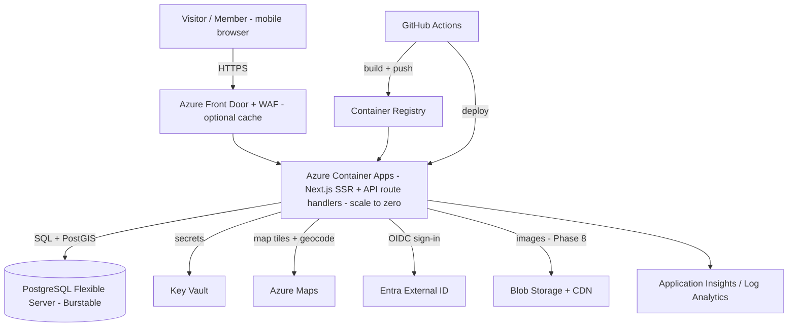
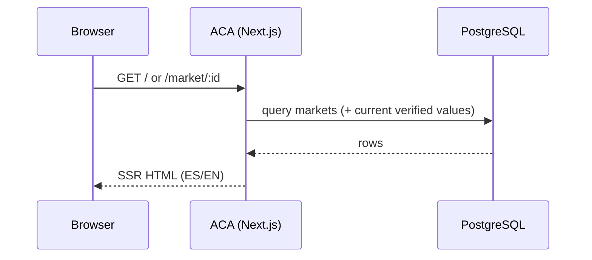
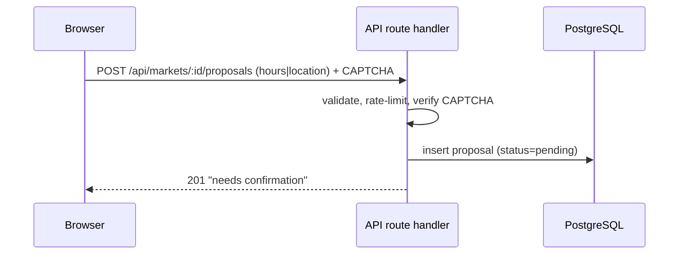

# Architecture Overview — La Feria CR

**Status:** 🟡 Draft · _Last updated: 2026-06-30_

How La Feria CR is built on **Azure**, optimized for **low cost (serverless / scale-to-zero)**.
Decisions here are justified by the [ADRs](../decisions/README.md). Companion docs:
[data-model](data-model.md) · [rbac](rbac.md) · [moderation-trust](moderation-trust.md) ·
[infrastructure](infrastructure.md) · [security-privacy](security-privacy.md).

## Tech stack
- **Frontend/SSR:** Next.js 16 (App Router) + React 19 + TypeScript + Tailwind CSS v4.
- **API:** Next.js **route handlers** (no separate API service to operate).
- **Data:** Azure Database for PostgreSQL Flexible Server + PostGIS, accessed via an ORM (Prisma or Drizzle).
- **Identity:** Microsoft Entra External ID (Google + email OTP).
- **Maps:** Azure Maps Web SDK + geocoding.
- **Hosting:** Azure Container Apps (scale-to-zero).

## System context



## Component responsibilities
| Component | Responsibility | Why |
| --- | --- | --- |
| **Container Apps (ACA)** | Run the Next.js container (SSR + API), scale 0→N | Full App-Router SSR; cheapest real-Next.js serverless ([ADR-0003](../decisions/0003-compute-azure-container-apps.md)) |
| **PostgreSQL Flexible + PostGIS** | Markets, proposals, confirmations, roles, audit; geo queries | Relational integrity + "near me" ([ADR-0004](../decisions/0004-database-postgresql-flexible.md)) |
| **Entra External ID** | Sign-in for confirming/moderating | Managed identity, social + OTP ([ADR-0005](../decisions/0005-identity-entra-external-id.md)) |
| **Azure Maps** | Display markets, drop/confirm pins, geocode | Native Azure, single bill ([ADR-0006](../decisions/0006-maps-azure-maps.md)) |
| **Key Vault** | Secrets (DB conn, Maps key, IdP secret) | No secrets in code/config |
| **Application Insights** | Logs, metrics, traces (sampled) | Observability at low cost |
| **ACR** | Store app container image | Source for ACA deploys |
| **Front Door + WAF** | Edge cache + basic protection (incremental) | Performance + abuse mitigation |
| **Blob Storage + CDN** | Market photos (Phase 8) | Cheap object storage + delivery |

## Key principle: official list = seed source of truth
The official June 2026 spreadsheet seeds the `markets` table. **Community contributions are
overlays/proposals** on top of seeded records; an unedited market always shows its official values.
Official data is never overwritten in place — promotions create new verified values with history.
See [data-model](data-model.md).

## Core request flows

**Read (browse / detail)** — Anonymous, cacheable.


**Propose (anonymous allowed)**


**Confirm (account required) → auto-promote**
```mermaid
sequenceDiagram
  participant U as Member
  participant A as API route handler
  participant D as PostgreSQL
  U->>A: POST /api/proposals/:id/confirm (Bearer token)
  A->>A: authZ (role>=Member), one-vote-per-user
  A->>D: insert confirmation; recompute count
  alt count >= N
    A->>D: promote proposal -> market verified value (+ history)
  end
  A-->>U: updated proposal/market state
```

Moderation and promotion rules: see [moderation-trust](moderation-trust.md). Authorization model:
see [rbac](rbac.md).

## Environments
- **dev** and **prod** as separate resource groups (and ideally subscriptions), provisioned by the
  same Bicep with parameters. Scale-to-zero keeps non-prod cheap. Details in
  [infrastructure](infrastructure.md).

## Cross-cutting
- **i18n:** UI strings + key dynamic content in ES/EN.
- **Security/privacy:** [security-privacy](security-privacy.md).
- **Observability:** App Insights traces across SSR + API; structured logs.
