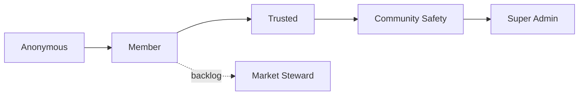

# Roles & Permissions (RBAC) — La Feria CR

**Status:** 🟡 Draft · _Last updated: 2026-06-30_

Authorization model: who can do what, and how it's enforced. Implemented in **Phase 4**
([roadmap](../product/roadmap.md)). Identity is provided by Entra External ID
([ADR-0005](../decisions/0005-identity-entra-external-id.md)); roles are stored in `user_roles`
([data-model](data-model.md)).

## Role hierarchy

| Role | Who | Gets it by |
| --- | --- | --- |
| **Anonymous** | Any visitor | No sign-in |
| **Member** | Signed-in user | Signing in (Entra) |
| **Trusted** | Proven good contributor | Auto by reputation (Phase 6) or grant |
| **Community Safety** | Moderator | Appointed by Super Admin |
| **Super Admin** | Platform owner/operator | Bootstrapped; granted by Super Admin |
| **Market Steward** _(backlog)_ | Organizer/vendor for a market | Verified claim (Phase 8) |

Roles are **additive** — higher roles include lower-role capabilities.

## Capability matrix

| Capability | Anon | Member | Trusted | Community Safety | Super Admin |
| --- | :--: | :--: | :--: | :--: | :--: |
| Browse / search / view detail | ✅ | ✅ | ✅ | ✅ | ✅ |
| Propose edit (hours/location) | ✅ | ✅ | ✅ | ✅ | ✅ |
| Submit a new market | ✅ | ✅ | ✅ | ✅ | ✅ |
| Confirm / reject a proposal | ❌ | ✅ | ✅ | ✅ | ✅ |
| File a report | ✅ | ✅ | ✅ | ✅ | ✅ |
| Confirmation weight | — | 1× | higher | higher | higher |
| View moderation queue | ❌ | ❌ | ❌ | ✅ | ✅ |
| Remove/hide content; resolve reports | ❌ | ❌ | ❌ | ✅ | ✅ |
| Hide/disable a market | ❌ | ❌ | ❌ | ✅ | ✅ |
| Temp-ban a user | ❌ | ❌ | ❌ | ✅ | ✅ |
| Override field value directly | ❌ | ❌ | ❌ | ❌ | ✅ |
| Revert a change | ❌ | ❌ | ❌ | ✅* | ✅ |
| Manage roles | ❌ | ❌ | ❌ | ❌ | ✅ |
| Configure threshold **N** / policy | ❌ | ❌ | ❌ | ❌ | ✅ |
| View audit log | ❌ | ❌ | ❌ | ✅ | ✅ |

\* Community Safety reverts are limited to abuse remediation; structural overrides are Super-Admin only.

## Enforcement
- **Server-side only.** Every mutating API route re-checks the caller's role from a trusted source
  (DB-backed `user_roles`), never from client claims. UI hiding is convenience, not security.
- **Identity:** bearer token from Entra is validated per request; the app resolves the internal
  `user.id` and roles.
- **Least privilege & scope:** roles may carry a `scope` (e.g. region) so future moderators act only
  within their area.
- **One-vote integrity:** confirmations are unique per `(proposal, user)`.
- **Audit:** every privileged action writes `moderation_actions` (and `change_history` where data
  changes) — see [data-model](data-model.md).

## Appointment & governance
- **Super Admin** is bootstrapped during setup (first operator). Additional admins are granted by an
  existing Super Admin.
- **Community Safety** moderators are appointed by a Super Admin; vetting criteria and optional
  regional scoping are an **open question** ([moderation-trust](moderation-trust.md)).
- **Trusted** is earned automatically via reputation in Phase 6 (or granted manually before then).
- Role changes are themselves audited.

## Open questions
- Vetting/onboarding for Community Safety; regional scoping rollout.
- Exact confirmation **weights** per role and when weighting turns on.
- Whether Trusted unlocks any moderation-lite capabilities (currently none).
