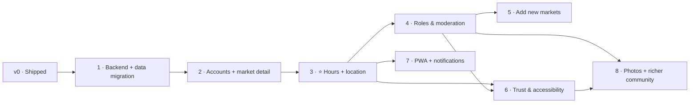

# Roadmap — La Feria CR

**Status:** 🟡 Draft · _Last updated: 2026-06-30_

Phased delivery from the shipped static directory (v0) to a community-maintained, photo-rich guide.
No dates — phases are ordered by dependency and value. Requirements are in [prd.md](prd.md);
architecture in [../architecture/overview.md](../architecture/overview.md).

---

## v0 — Shipped ✅
Static, bilingual, mobile-first directory of 66 official markets; "this weekend" default; day/region
filters; search; tap-to-call. No backend, no accounts. **This is the baseline all phases build on.**

## Phase 1 — Backend foundation & data migration _(invisible to users)_
**Goal:** stand up Azure infrastructure and move data into a database without changing the UX.
- Provision Azure via Bicep: Container Apps + ACR, PostgreSQL Flexible (+PostGIS), Key Vault,
  Application Insights, Azure Maps, Entra External ID tenant.
- Containerize the Next.js app; GitHub Actions CI/CD to Container Apps.
- Add ORM + schema; **seed markets from the official list** (`src/data/ferias.json`).
- Switch reads from the static import to the database.
- **Exit criteria:** app behaves exactly like v0, now DB-backed and deployed on Azure.

## Phase 2 — Accounts & market detail
**Goal:** identity + a place to show and (soon) edit per-market info.
- Integrate Entra External ID (Google + email OTP); login needed only to confirm.
- Per-market **detail page**: hours, location, days, organizer, freshness/confidence.
- Azure Maps display with a pin where coordinates exist.
- **Exit criteria:** users can sign in; every market has a detail page with a map.

## Phase 3 — ⭐ Community contributions: hours + location _(first community release)_
**Goal:** the core propose → confirm → verify loop.
- Anonymous **"Suggest an edit"** for hours and for location (pin drop / use my location).
- Signed-in **confirm/reject**; **auto-promotion** at threshold **N**; conflict display.
- Verified / needs-confirmation badges; last-updated; confirmation counts.
- Reporting/flagging; rate limiting; CAPTCHA; reversible history; minimal admin break-glass.
- **Exit criteria:** the public can improve and verify real hours/locations safely.

## Phase 4 — Roles, permissions & moderation
**Goal:** real governance to replace break-glass.
- Implement RBAC: Member, Trusted, **Community Safety**, **Super Admin** ([rbac.md](../architecture/rbac.md)).
- Community Safety tooling: reports queue, content removal, hide/disable markets, temp-bans.
- Super Admin tooling: override fields, manage roles, configure **N**, revert; full audit trail.
- **Exit criteria:** moderators and admins can keep content safe with audited, reversible actions.

## Phase 5 — Add new markets (community-submitted)
**Goal:** grow beyond the official list.
- "Add a market" flow; **duplicate detection** (name + proximity).
- New markets enter pending/unverified; promoted by confirmations; subject to moderation.
- **Provenance labels:** Official (2026 list) vs Community-added.
- **Exit criteria:** the community can responsibly add markets the official list misses.

## Phase 6 — Trust & accessibility hardening
**Goal:** stronger trust signals and inclusive UX.
- Reputation-weighted confirmations; anti-sybil heuristics; conflict-resolution UX.
- **Accessibility:** large-text & high-contrast modes, plain language, big tap targets; usability
  testing across age groups ([accessibility.md](../accessibility.md)).
- Observability/alerting, WAF, backups & DR, privacy/consent & UGC terms.
- **Exit criteria:** measurably trustworthy data and a usability/accessibility bar met.

## Phase 7 — PWA + notifications
**Goal:** re-engagement and offline access.
- Installable PWA; offline cache of the market list.
- Opt-in web push / Azure Notification Hubs ("open near you this weekend", "hours changed").
- **Exit criteria:** users can install the app and opt into useful reminders.

## Phase 8 — Photos (north star) + richer community
**Goal:** make markets feel real, then deepen community value.
- Photo uploads → Blob Storage + CDN, with Azure AI Content Safety + Community Safety moderation.
- **Backlog, in order:** reviews & ratings → products & seasonal prices → favorites & reminders →
  vendor/organizer official accounts (Market Steward).
- **Exit criteria:** markets have community photos; a backlog path for richer features is set.

---

## Dependencies summary
- Everything depends on **Phase 1** (data + platform).
- Contributions (**3**) require accounts/detail (**2**).
- Governance (**4**) and new markets (**5**) build on contributions (**3**); **5** needs roles (**4**).
- Hardening (**6**) builds on **3** + **4**; PWA (**7**) builds on **3**; Photos (**8**) need roles
  (**4**) for moderation and benefit from hardening (**6**).

## Risks & mitigations
- **Abuse / vandalism** → account-gated confirmations, rate limits, CAPTCHA, reporting, roles, audit.
- **Sparse early contributions** → seed with official data; keep proposing frictionless; sensible N.
- **Cost creep** → serverless/scale-to-zero; review spend per phase.
- **Accessibility regressions** → bake in from Phase 2; formal pass in Phase 6.
