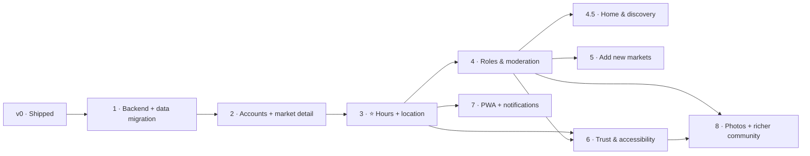

# Roadmap — La Feria CR

**Status:** 🟡 Draft · _Last updated: 2026-07-08 (Phase 5 community markets shipped on dev; desktop nav dropdowns)_

Phased delivery from the shipped static directory (v0) to a community-maintained, photo-rich guide.
No dates — phases are ordered by dependency and value. Requirements are in [prd.md](prd.md);
architecture in [../architecture/overview.md](../architecture/overview.md).

> **Spec Kit:** the forward-looking phases below — **4.5, 6, 7, 8** — are also maintained as Spec Kit
> specs in [`../../laferiaspecs/specs/`](../../laferiaspecs/specs/) (name-first home, trust &
> accessibility, PWA + notifications, photos). Continue those with the `/speckit.*` flow.

---

## v0 — Shipped ✅
Static, bilingual, mobile-first directory of 66 official markets (the June 2026 seed; **73 live as of
2026-07-08** — 72 official + 1 community); "this weekend" default; day/region filters; search; tap-to-call.
No backend, no accounts. **This is the baseline all phases build on.**

## Phase 1 — Backend foundation & data migration _(invisible to users)_
**Status:** ✅ Done — live on **dev** (Azure infra + CI/CD; DB-backed reads with v0 parity).
**Goal:** stand up Azure infrastructure and move data into a database without changing the UX.
- Provision Azure via Bicep: Container Apps + ACR, PostgreSQL Flexible (+PostGIS), Key Vault,
  Application Insights, Azure Maps, Entra External ID tenant.
- Containerize the Next.js app; GitHub Actions CI/CD to Container Apps.
- Add ORM + schema; **seed markets from the official list** (`src/data/ferias.json`).
- Switch reads from the static import to the database.
- **Exit criteria:** app behaves exactly like v0, now DB-backed and deployed on Azure.

> 📋 Executable checklist: [phase-1-tasks.md](phase-1-tasks.md).

## Phase 2 — Accounts & market detail
**Status:** ✅ Done — live on **dev** (detail pages + keyless Azure Maps + Entra External ID sign-in; `users` upsert verified).
**Goal:** identity + a place to show and (soon) edit per-market info.
- Integrate Entra External ID (Google + email OTP); login needed only to confirm.
- Per-market **detail page**: hours, location, days, organizer, freshness/confidence.
- Azure Maps display with a pin where coordinates exist.
- **Exit criteria:** users can sign in; every market has a detail page with a map.
- **Scope note:** MVP 0 targets the **dev** environment only; prod is deferred.

> 📋 Executable checklist: [phase-2-tasks.md](phase-2-tasks.md).

## Phase 3 — ⭐ Community contributions: hours + location _(first community release)_
**Status:** ✅ Done — live on **dev** (propose → confirm → verify; auto-promotion at N=2; badges, conflicts, reporting, Postgres rate limiting, break-glass admin; verified end-to-end — e.g. Atenas location promoted). CAPTCHA seam present but flag-gated off; follow-ups tracked as BL-014…BL-016 ([phase-3-tasks](phase-3-tasks.md)).
**Goal:** the core propose → confirm → verify loop.
- Anonymous **"Suggest an edit"** for hours and for location (pin drop / use my location).
- Signed-in **confirm/reject**; **auto-promotion** at threshold **N = 2** (net confirmations); conflict display.
- Verified / needs-confirmation badges; last-updated; confirmation counts.
- Reporting/flagging; **Postgres-backed** rate limiting; CAPTCHA seam (flag-gated off on dev); reversible history; minimal admin break-glass.
- Decisions: [ADR-0012](../decisions/0012-anti-abuse-rate-limiting-and-captcha.md) (anti-abuse), [ADR-0013](../decisions/0013-minimal-roles-phase-3-break-glass.md) (minimal roles).
- **Exit criteria:** the public can improve and verify real hours/locations safely.

## Phase 4 — Roles, permissions & moderation
**Status:** 🚧 In progress — building on **dev** (full RBAC + moderation queue + temp-bans + admin UI; MVP 0, dev only).
**Goal:** real governance to replace break-glass.
- Implement RBAC: Member, Trusted, **Community Safety**, **Super Admin** ([rbac.md](../architecture/rbac.md)),
  enforced server-side from the DB; `trusted` is a manual marker (reputation grants are Phase 6).
- Community Safety tooling: reports queue, content removal, hide/disable markets, temp-bans.
- Super Admin tooling: override fields, manage roles, configure **N** (DB-backed), revert; full audit
  trail via the new `moderation_actions` table.
- Dedicated `/admin` UI + inline moderation controls on the market detail page.
- Decisions: [ADR-0014](../decisions/0014-rbac-moderation-queue-and-temp-bans.md) (RBAC + queue +
  `moderation_actions` + temp-bans), [ADR-0015](../decisions/0015-admin-configurable-settings-app-config.md)
  (admin-configurable settings). Deferred: reputation/auto-grant (Phase 6), regional scoping (OQ-003),
  auto-quarantine (OQ-009, decided against for now).
- **Exit criteria:** moderators and admins can keep content safe with audited, reversible actions.

> 📋 Executable checklist: [phase-4-tasks.md](phase-4-tasks.md).

## Phase 4.5 — Home & discovery redesign (name-first) _(near-term UX)_
**Status:** 🚧 In progress — discovery done (2026-07-07); **BL-023/024/025/026 shipped** (name-first hero, redesigned cards, no weekend default, region filter removed — OQ-013), plus a **home-redesign polish pass** (BL-029: brand wordmark + SVG motif, paginated A–Z directory with a bottom jump index, collapsible day filter, live search highlighting, wider grid). A near-term UX track that can run alongside/before Phase 5.
**Goal:** make the home page a **name-first, search-led** way to find the specific feria you're looking for — and feel less bare — without depending on location data (coverage was thin at discovery — 2 of 66; **as of 2026-07-08 it has grown to ~55 of 73 active markets (~75%)** via community approvals, so "near me" is now worth revisiting — BL-027/OQ-014).
- **Name-first search** as the primary find path; short bilingual hero + value prop + light market count.
- **Redesigned cards:** lead with the **name**; show **days open**; show **location only when present** (📍 link to the map); **drop region + phone** from the card (phone stays on the market detail page).
- **Drop the "this weekend" default** (scheduled days ≠ confirmed open/closed) — day filtering becomes optional.
- **Demote region** (administrative, not how users think — the name already implies the place); remove from the primary UI (OQ-013).
- **Cohesive visual + scannability polish (BL-029):** a shared brand wordmark + hand-built SVG motif, a **paginated A–Z directory** (10 per page) with an **A–Z jump index at the bottom** that jumps to the right page, a **collapsible day filter**, and **live search highlighting** (matched substrings, clear ✕, `/`-to-focus, query-aware empty state) — so the home feels intentionally designed within our no-photos/no-coords data reality.
- **Reconsidering (coverage improved):** "near me"/distance ranking and any map-first view were deferred pending location coverage; **as of 2026-07-08 ~55 of 73 markets (~75%) have coordinates**, so the coverage blocker is largely cleared — the geocode-the-list enabler (BL-028) is now likely unnecessary (BL-027, OQ-014).
- **Exit criteria:** a returning user can find a specific market by name in seconds; the home leads with names and shows days (and location where known), with region/phone no longer competing for attention.
- Backlog: BL-023…BL-029; decisions OQ-013, OQ-014.

## Phase 5 — Add new markets (community-submitted)
**Status:** ✅ Done — live on **dev** (2026-07-08; [ADR-0009](../decisions/0009-community-submitted-markets.md)) — `/markets/new` submission flow (sign-in required, rate-limited + CAPTCHA-gated), soft duplicate detection (name + proximity, warn-only — never blocks), `/markets/pending` community-confirmation queue with auto-promotion to a `source=community` market at N net confirmations, provenance badges, and moderation of submissions (reportable + removable). Migration deployed and smoke-tested end-to-end.
**Goal:** grow beyond the official list.
- "Add a market" flow; **duplicate detection** (name + proximity).
- New markets enter pending/unverified; promoted by confirmations; subject to moderation.
- **Provenance labels:** Official (2026 list) vs Community-added.
- **Exit criteria:** the community can responsibly add markets the official list misses.

## Phase 6 — Trust & accessibility hardening
**Goal:** stronger trust signals and inclusive UX.
- Reputation-weighted confirmations; anti-sybil heuristics; conflict-resolution UX.
- **Accessibility:** large-text & high-contrast modes, plain language, big tap targets; usability
  testing across age groups ([accessibility.md](../accessibility.md)).
- Observability/alerting, WAF, backups & DR, privacy/consent & UGC terms.
- **Exit criteria:** measurably trustworthy data and a usability/accessibility bar met.

## Phase 7 — PWA + notifications
**Goal:** re-engagement and offline access.
- Installable PWA; offline cache of the market list.
- Opt-in web push / Azure Notification Hubs ("open near you this weekend", "hours changed").
- **Exit criteria:** users can install the app and opt into useful reminders.

## Phase 8 — Photos (north star) + richer community
**Goal:** make markets feel real, then deepen community value.
- Photo uploads → Blob Storage + CDN, with Azure AI Content Safety + Community Safety moderation.
- **Backlog, in order:** reviews & ratings → products & seasonal prices → favorites & reminders →
  vendor/organizer official accounts (Market Steward).
- **Exit criteria:** markets have community photos; a backlog path for richer features is set.

---

## Dependencies summary
- Everything depends on **Phase 1** (data + platform).
- Contributions (**3**) require accounts/detail (**2**).
- Governance (**4**) and new markets (**5**) build on contributions (**3**); **5** needs roles (**4**).
- **Home & discovery (4.5)** is a near-term UX track, independent of the numbered feature phases; its "near me" piece is deferred until location coverage grows.
- Hardening (**6**) builds on **3** + **4**; PWA (**7**) builds on **3**; Photos (**8**) need roles
  (**4**) for moderation and benefit from hardening (**6**).

## Risks & mitigations
- **Abuse / vandalism** → account-gated confirmations, rate limits, CAPTCHA, reporting, roles, audit.
- **Sparse early contributions** → seed with official data; keep proposing frictionless; sensible N.
- **Cost creep** → serverless/scale-to-zero; review spend per phase.
- **Accessibility regressions** → bake in from Phase 2; formal pass in Phase 6.
